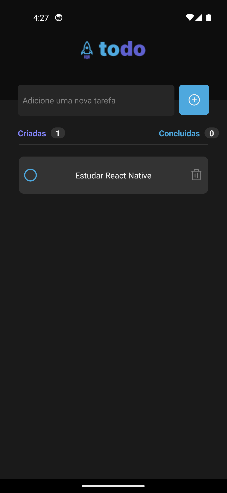
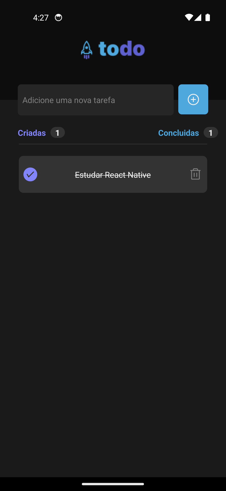

# 📸 Overview:




# 💻 Project:
## Aplicação Mobile que Cria, Deleta e Conclui tarfefas do dia a dia.

# 🚀 Technologies:
### ✔️ React-Native
### ✔️ Styled-Components
### ✔️ Typescript

# How to run

```
# Clone this repository
$ git clone https://github.com/vinnycosta9898/ignite-todo-app

# Go to the directory
$ cd ignite-todo-app

# Install Dependencies
$ npm install

# Run Web Server
$ npx expo start